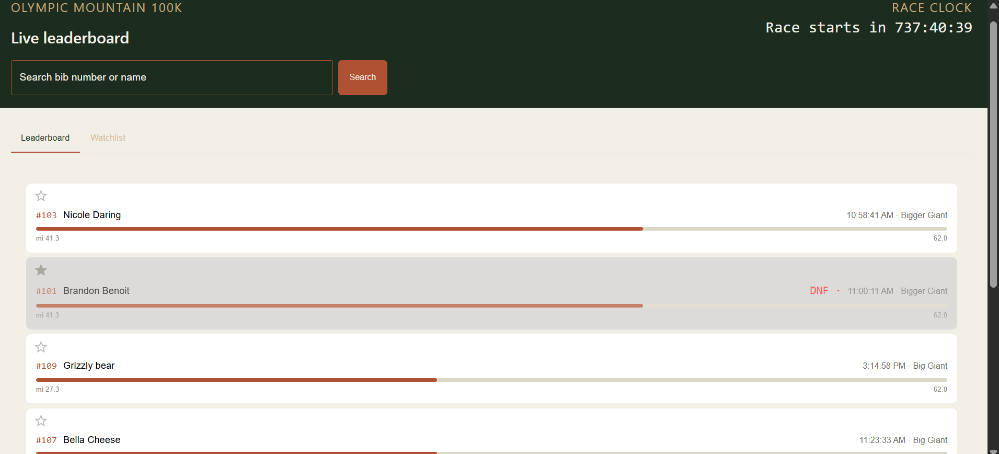
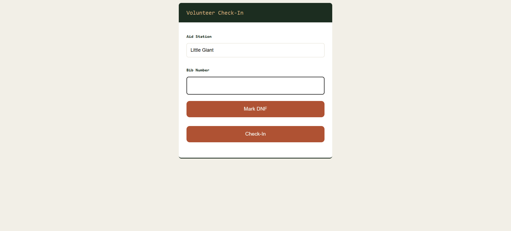
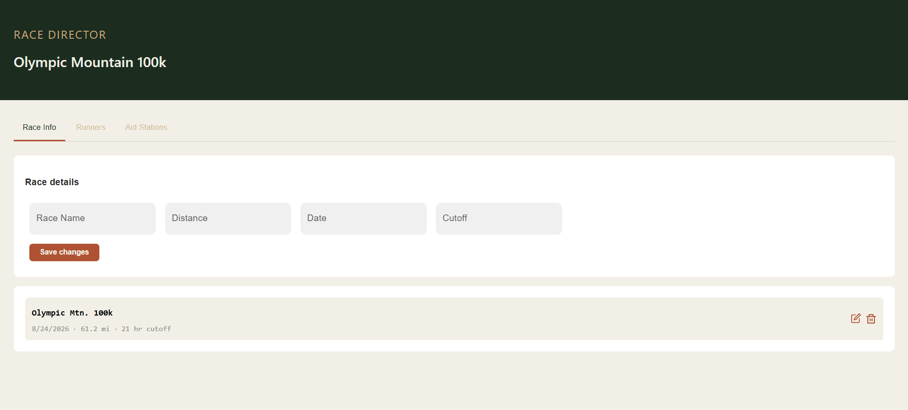

# Olympic Mountain Race Tracker

A live race tracking application built for ultra trail races. Volunteers at aid stations log runner check-ins, and crews/spectators watch a real-time leaderboard showing where their runner is on the course.

**Live demo:** https://runner-tracker-frontend.vercel.app

---

## Screenshots





---

## Tech stack

**Frontend:** React, TypeScript, Vite, Material UI, Socket.io client  
**Backend:** Node.js, Express, TypeScript  
**Database:** PostgreSQL  
**Auth:** JWT, bcrypt  
**Real-time:** Socket.io WebSockets  
**Deployment:** Vercel (frontend), Render (backend + database)  
**CI:** GitHub Actions  

---

## Features

- Live leaderboard with real-time updates via WebSockets — no page refresh needed
- Volunteer check-in screen optimized for mobile use at aid stations
- Runner search by name or bib number with full journey timeline
- Watchlist — spectators can save runners to follow
- DNF tracking with visual status indicators
- Race director dashboard to manage races, runners, and aid stations
- Role-based auth (admin vs volunteer)
- Race clock with countdown to race start

---

## Architecture decisions

**Why WebSockets over polling:** Crews and spectators shouldn't have to manually refresh to see updates. When a volunteer checks in a runner, Socket.io broadcasts the event to every connected client instantly. This makes the leaderboard feel alive during a race.

**Junction table for check-ins:** A runner can check in at many aid stations, and an aid station sees many runners — a many-to-many relationship. The `check_in` table acts as a junction table storing the runner ID, aid station ID, and timestamp for each event.

**Separate auth roles:** Race directors need full CRUD access. Volunteers only need the check-in screen. The public tracker page stays open. Crews don't need to log in to follow their runner.

**UTC for timestamps:** After debugging a three-layer timezone issue spanning Node's pg driver, Postgres session settings, and frontend display, all timestamps are stored and transmitted in UTC and converted to local time only at the display layer.

---

## Running locally

### Prerequisites
- Node.js
- PostgreSQL

### Backend
```bash
git clone https://github.com/grizz-bot92/runner-tracker
cd runner-tracker
npm install
cp .env.example .env
npm run dev
```

### Frontend
```bash
git clone https://github.com/grizz-bot92/runner_tracker_frontend
cd runner-tracker-frontend
npm install
cp .env.example .env 
npm run dev
```

### Database
Create a PostgreSQL database and run the schema from `scripts/schema.sql`.

---

## Built by

Brandon Benoit — massage therapist, ultra runner, CS student. Built this for my mom's 100k trail race.